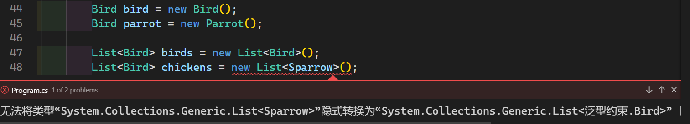

# [泛型中的协变和逆变](https://docs.microsoft.com/zh-cn/dotnet/standard/generics/covariance-and-contravariance)

> [微软官方](https://docs.microsoft.com/zh-cn/dotnet/standard/generics/covariance-and-contravariance)

## 为什么会有协变和逆变

此处给出一个例子

定义了一个 **`Bird` 类**, `Chicken` 和 `Parrot` 是 `Bird` 的子类。

```csharp
public class Bird { public int Id { get; set; } }
public class Chicken : Bird { public string Name { get; set; } }
// Parrot -- 鹦鹉
public class Parrot : Bird
{
    // 模仿说话
    public void imitate() { System.Console.WriteLine("imitate speak"); }
}
```

我们在定义的时候可以 new 一个子类的对象放到父类的容器中。这肯定是没问题的，因为鹦鹉肯定是属于鸟类。

```csharp
Bird bird = new Bird();
Bird parrot = new Parrot(); // 子类变量可以赋值给父类变量
```

可是在使用泛型的 `List<T>` 时，却不行。这很明显不符合常理.


```csharp
List<Bird> birds = new List<Bird>();
List<Bird> parrot = new List<Parrot>();// 错误示范
List<Bird> parrots = new List<Parrot>().Select(x => (Bird)x).ToList(); // 将集合里的元素转换成父类

```

发生错误的原因是, `Parrot` 虽然是 `Bird` 的子类，但是 `List<Bird>`不是 `List<Parrot>`的子类。

他们是不同的。

像这种情况我们可以用 `out` 关键字来解决。

## out 关键字

> 协变类型参数用 out 关键字（在 Visual Basic 中为 Out 关键字）标记。 可以将协变类型参数用作属于接口的方法的返回值，或用作委托的返回类型。 但不能将协变类型参数用作接口方法的泛型类型约束。